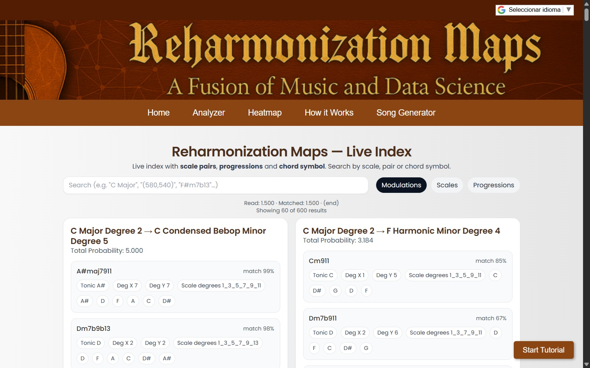
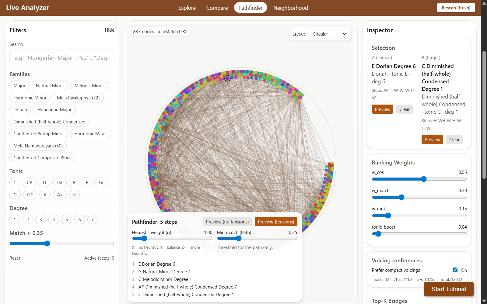
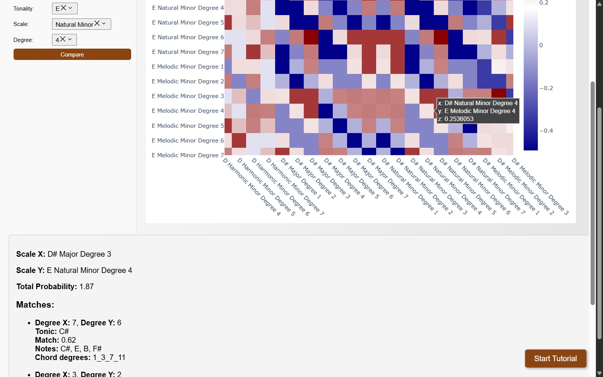
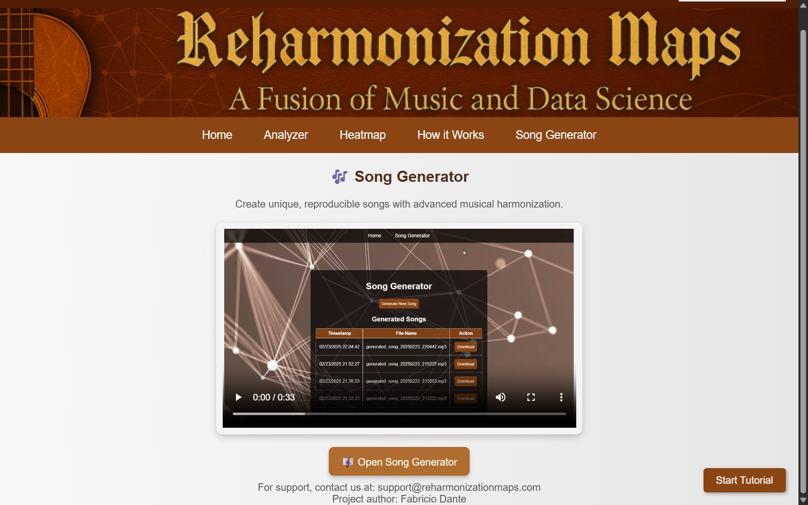

# Reharmonization Maps (RM)

**Reharmonization Maps (RM)** is a large-scale harmonic compatibility platform designed to explore structural relationships between scales, modes, and chord systems across multiple tonal families.

The platform provides an interactive analytical environment built on a precomputed modal compatibility graph derived from systematic symbolic comparisons.

This repository documents the public web platform architecture and conceptual framework.  
The production backend and core engine are not included.

🌐 Live Platform:  
https://reharmonizationmaps.com

---

## 1. Conceptual Overview

Reharmonization Maps is based on a deterministic symbolic system that:

- Generates modal structures across multiple parent scales
- Computes cross-scale chord compatibility
- Assigns probabilistic compatibility scores
- Stores large-scale pairwise relationships
- Exposes the results through interactive analytical interfaces

The system does **not** rely on neural generative models.  
All harmonic relationships are derived from explicit structural rules and symbolic comparison logic.

The goal is structural clarity rather than stylistic emulation.

---

## 2. Data Scale

The full Reharmonization Maps system operates on:

- 12 tonics  
- 12 parent scale families  
- 7 modal degrees per scale  

This yields:

- **1008 modal nodes** in the complete harmonic space  

The full modal graph therefore contains **over one million potential pairwise relationships**  
(1008 × 1008 ≈ 1,016,064).

The Heatmap subsystem represents a reduced configuration:

- 4 parent scales  
- 12 tonics  
- 7 degrees  
- 336 modal nodes  

Filtered web datasets (~600k structured relationships) are used to balance performance and analytical richness.

---

## 3. Platform Modules

---

### 3.1 Live Index

Interactive real-time lookup engine for harmonic relationships.

Features:

- Query-based modal matching
- Structured compatibility scoring
- Bridge chord identification
- Deterministic ranking logic
- Scale-to-scale modulation discovery
- Real-time streaming results

The Live Index operates over millions of precomputed comparisons and exposes compatibility signals between modal pairs.

---

### 3.2 Live Analyzer

Graph-based structural visualization of modal relationships.

Features:

- Node–edge representation of modal compatibility network
- Circular and structured layouts
- A* pathfinding across modal space
- Adjustable ranking weights
- Neighborhood exploration
- Structural filtering by family, tonic, and degree

**Audio Preview:**  
The "Preview" buttons allow real-time audio playback of:

- Individual scales  
- Candidate bridge chords  
- Path transitions  

This integrates auditory verification directly into structural exploration.

The Analyzer treats harmonic modulation as a topological navigation problem.

---

### 3.3 Harmonic Heatmap

Subdomain: https://heatmap.reharmonizationmaps.com

Dash + Plotly visualization of modal compatibility matrix.

Features:

- 336 × 336 compatibility matrix
- Log-scaled probability visualization
- Tonality / scale / degree comparison
- Detailed match inspection
- Interval-weighted compatibility signals

The heatmap provides a matrix-based analytical perspective of the compatibility graph.

---

### 3.4 How It Works

The **How It Works** section provides a conceptual explanation of the system as exposed through the web interface.

Rather than presenting abstract theory, this page explains how the platform operates from the user's perspective while clarifying the underlying structural logic.

### What the user sees

The section describes how:

- Scale relationships are computed between **Scale X → Scale Y**.
- Precomputed comparisons are indexed for real-time lookup.
- Bridge chords connect modal regions.
- Compatibility signals summarize structural overlap.
- Results include degrees, chord tones, and weighted match values.

This aligns directly with the behavior of the Live Index, Analyzer, and Heatmap tools shown in the interface.

### Conceptual pipeline (internal logic)

Behind the interface, the system follows a deterministic symbolic process:

1. Symbolic scale definition (interval structures).
2. Modal rotation by degree (1–7).
3. Deterministic chord extraction from each mode.
4. Interval-based weighted compatibility scoring.
5. Large-scale pairwise storage of results.
6. Web-based interactive exposure via indexed lookup.

Compatibility signals are derived from **structural interval overlap**, not stylistic modeling or machine learning.

The system therefore operates as a deterministic generative framework grounded in formal musical interval logic.

---

### 3.5 Song Generator

The Song Generator module builds reproducible compositions using:

- Deterministic modal transitions  
- Bridge chord selection  
- Structured modulation paths  
- Controlled probabilistic weighting  

Generated compositions are reproducible given identical parameters and seeds.

The full engine implementation is documented separately:

🔗 **RM Song Generator Repository**  
https://github.com/Fabri-D/RM-Song-Generator

The Song Generator extends the modal compatibility graph into structured compositional sequences, operating under the same deterministic structural principles as the analytical platform.

---

## 4. Backend & Infrastructure

### Application Layer
- Python (Flask)
- Dash (Plotly)
- Structured JSON datasets
- SQLite (used for terms acceptance and consent logging in the Song Generator module)
- Rate limiting (Flask-Limiter)
- CSRF protection
- CORS restrictions
- Security headers hardening

### Deployment & Infrastructure
- Dockerized services
- Apache (cPanel environment) as reverse proxy
- WSGI-based serving
- SSL (Let's Encrypt)
- Subdomain isolation for modular components
- Controlled resource allocation for large datasets

The harmonic engine is maintained separately from the public web layer.

---

## 5. Structural Philosophy

Reharmonization Maps follows a **structure-first generative systems** approach:

- Deterministic symbolic modeling
- Explicit rule-based harmonic generation
- Large-scale modal compatibility graphs
- No stylistic imitation
- No probabilistic black-box generation

The system frames harmonic modulation as navigation within a structured modal topology.

---

## 6. Reproducibility

All relationships derive from:

- Explicit symbolic scale definitions
- Deterministic chord construction logic
- Interval-weighted compatibility scoring
- Precomputed pairwise storage

Given identical datasets and rules, results are reproducible.

---

## 7. Status

Reharmonization Maps is an actively maintained research platform.

The public interface represents an analytical layer over a deterministic harmonic engine deployed in a production-grade containerized environment.

---

## Recognition

A related module in the Reharmonization Maps ecosystem, **RM Song Generator**, was selected as a **semifinalist entry** in the **AI Song Contest 2025**:

🔗 https://www.aisongcontest.com/participants-2025/blacksteel  
🔗 https://github.com/Fabri-D/RM-Song-Generator

---

## Author

Fabricio Dante  
AI Engineer — Deterministic Generative Systems  
Creator of Reharmonization Maps
